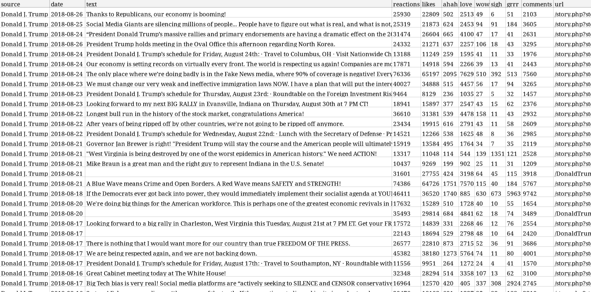
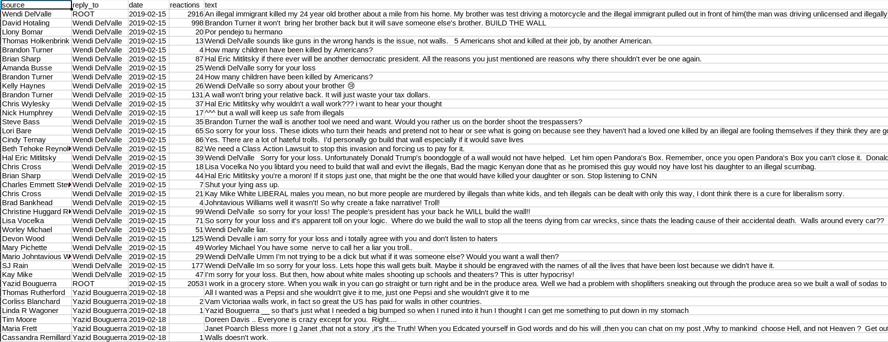

# fbcrawl
Fbcrawl is an advanced crawler for Facebook, written in python, based on the [Scrapy](https://scrapy.org/) framework. 

## DONATIONS
Fbcrawl is free software. It is not "free as beer" nor "free as speech", it is "free as a toilet": it is always available and working, but someone as to keep it clean and tidy, and I am the only one at the moment, it is not a community project. Please consider make a donation, it will keep this project alive and if I see actual interest from people I will get on with the [TODO](https://github.com/rugantio/fbcrawl/blob/master/README.md#TODO) list. One of the my long-term goal is to refactor the framework with a gui, connections to databases and graph vizualitations. These tasks would take at least a couple of months of work, and I will be able to afford them only with your support! Thank you :)

[](https://www.paypal.com/cgi-bin/webscr?cmd=_donations&business=G96T8U8W7UZDL&currency_code=EUR&source=url)

## DISCLAIMER
This software is not authorized by Facebook and doesn't follow Facebook's [robots.txt](https://www.facebook.com/robots.txt). Scraping without Facebook explicit written is a violation of the [terms and conditions on scraping](http://www.facebook.com/apps/site_scraping_tos_terms.php) and can potentially cause a [lawsuit](https://petewarden.com/2010/04/05/how-i-got-sued-by-facebook/)

This software is provided as is, for educational purposes, to show how a crawler can be made to recursively parse a facebook page. Use at your own risk.

# Introduction

<div style="text-align:center">

</div>

EDIT: fbcrawl can now crawl comments! check out the "how to crawl comments" section!

What features can fbcrawl obtain? Everything that you see in the table is crawled by default. I decided to simplify the timestamp feature, leaving out the hour and to ignore comments and commentators, which are going to be parsed post-by-post by another crawler.

Fbcrawl makes use of an static mobile version of facebook, unknown to many: [https://mbasic.facebook.com](https://mbasic.facebook.com) because it's all plain HTML and we can navigate easily through the pages without having to emulate a browser or inject javascript code.

## Installation
Requirements are: **python3** (python2 is also supported) and the  **scrapy** framework, that should pull other needed libs as dependencies (twisted, libxml2 etc.).

Scrapy can be installed through the package manager of the distribution (in my arch box is simply called "scrapy") or through internal python package system, typing:

 ```pip install scrapy```

## Architecture
The way scrapy works is through an engine that manages granularly every step of the crawling process.


The project is thus divided in several files that serve different purposes:

\fbcrawl
<br />&nbsp;&nbsp;&nbsp;&nbsp;
    README.md -- this file
<br />&nbsp;&nbsp;&nbsp;&nbsp;
    scrapy.cfg -- ini-style file that defines the project
<br />&nbsp;&nbsp;&nbsp;&nbsp;
    \fbcrawl
<br />&nbsp;&nbsp;&nbsp;&nbsp;&nbsp;&nbsp;&nbsp;&nbsp;
        \__init.py__
<br />&nbsp;&nbsp;&nbsp;&nbsp;&nbsp;&nbsp;&nbsp;&nbsp;
        **items.py** -- defines the fields that we want to export
<br />&nbsp;&nbsp;&nbsp;&nbsp;&nbsp;&nbsp;&nbsp;&nbsp;
        middlewares.py
<br />&nbsp;&nbsp;&nbsp;&nbsp;&nbsp;&nbsp;&nbsp;&nbsp;
        **pipelines.py** -- defines how we handle each item (the set of fields)
<br />&nbsp;&nbsp;&nbsp;&nbsp;&nbsp;&nbsp;&nbsp;&nbsp;
        **settings.py** -- all the parameter settings of the project
<br />&nbsp;&nbsp;&nbsp;&nbsp;&nbsp;&nbsp;&nbsp;&nbsp;
        \spiders
<br />&nbsp;&nbsp;&nbsp;&nbsp;&nbsp;&nbsp;&nbsp;&nbsp;&nbsp;&nbsp;&nbsp;&nbsp;
        \__init.py__
<br />&nbsp;&nbsp;&nbsp;&nbsp;&nbsp;&nbsp;&nbsp;&nbsp;&nbsp;&nbsp;&nbsp;&nbsp;
        **fbcrawl.py** -- implements the spider for posts
<br />&nbsp;&nbsp;&nbsp;&nbsp;&nbsp;&nbsp;&nbsp;&nbsp;&nbsp;&nbsp;&nbsp;&nbsp;
        **comments.py** -- implements the spider for comments

## How to crawl a page (fbcrawl.py)
The core of the crawler is this spider class, `fbcrawl`. On init, it navigates to `mbasic.facebook.com` and logs into facebook according to the provided `credentials`, passed as parameters at execution time (see "How to use"). Then the `parse_page` method is called with the `page` name given at runtime and the crawling process begins recursively retrieving all the posts found in every page. For each of the post it retrieves all the features, using the callback `parse_post`, and all the reactions, using `parse_reactions`.

The webpage are parsed and the fields are extracted using **XPath** selectors. These selectors are implemented on the python lib `lxml` so they are very fast.

Thanks to XPath, scrapy can navigate the webpage in a DOM model, as one would navigate a filesystem, with several features of pattern matching. If you know nothing about XPath [this guide](https://blog.scrapinghub.com/2016/10/27/an-introduction-to-xpath-with-examples/) and [this cheatsheet](https://devhints.io/xpath) can be helpful. Other resources are the original [W3C docs](https://www.w3.org/TR/2017/REC-xpath-31-20170321/) and [XPath functions](https://docs.oracle.com/cd/E35413_01/doc.722/e35419/dev_xpath_functions.htm).

The XPath are easy to obtain using Firefox's or Chromium's dev tools, but sometimes the field relative to a property changes location, which is something to keep in mind. For example, notice how I had to handle the `source` field using the pipe `|` that is the OR operator: `new.add_xpath('source', '//span/strong/a/text() | //div/a/strong/text() | //td/div/h3/strong/a/text()')`. This kind of juggling is helpful to maintain consistency of the data in our table. The control on the data and the policy to use is often implemented in the Item Pipeline.

So the parse methods populates Item fields (to be explained in the next section) and pass control over to the Item Loader.

Refer to Scrapy's [Spider documentation](https://docs.scrapy.org/en/latest/topics/spiders.html) for more info.

## Items (items.py)
This file defines an Item class, so that the fields that we have extracted can be grouped in Items and organized in a more concise manner. Item objects are simple containers used to collect the scraped data. They provide a dictionary-like API with a convenient syntax for declaring their available fields.

I have extracted every field present in the post elements and add a few local ones. Namely for each article we have:

```
source      -    name of the post publisher, if it's shared it's the original one
shared_from -    if the post is shared, is the name profile of the original post creator
date        -    timestamp in datetime.date() format
text        -    full text of the post, if empty it's a pic or a video
reactions   -    total number of reactions
likes       -    number of likes 
ahah        -    number of ahah
love        -    number of love
wow         -    number of wow
sigh        -    number if sigh
grrr        -    number of grrr
comments    -    number of comments
url         -    relative link to the post
```
Notice that this file is also used to modify the fields that we want to change before deciding what to do with the items. To accomplish these kinds of tasks, scrapy provides a series of built-in "`processors`" (such as the `input_processor`) and functions (such as `TakeFirst()`) that we can use to adjust the fields we want. These are explained in the official [Item Loaders](https://docs.scrapy.org/en/latest/topics/loaders.html) section of the documentation.

Also Refer to Scrapy's [Item documentation](https://docs.scrapy.org/en/latest/topics/items.html) for more info.

## Settings (settings.py)
Scrapy is a very powerful framework and it allows complex tweaking to be put in place. In this project we changed just only a handful of settings, but keep in mind that there are a lot of them.
To make the crawler synchronous and get all the items one-by-one so that they are chronologically ordered in the final CSV you can set CONCURRENT_REQUESTS = 1 in settings.py.

Pipelines are useful methods to manipulate items as you can see from the [official guide](https://doc.scrapy.org/en/latest/topics/item-pipeline.html). In our project I have prepared a pipeline to drop all the posts that were made before a certain date, you can check out the code in `pipelines.py`. Pipelines are not initialized by default, they need to be declared here. Since we can define more than one of them a number in the 0-1000 range is used to indicate priority (lower is first). This is why we have set:
```
ITEM_PIPELINES = {
    'fbcrawl.pipelines.FbcrawlPipeline': 300,
}
```
Besides dropping our items according to timestamp we can also export it locally to a CSV or a JSON. In case we choose to create a CSV file we need to specify the order of the columns by explicitly setting:
```
FEED_EXPORT_FIELDS = ["source", "date", "text", "reactions","likes","ahah","love","wow","sigh","grrr","comments","url"]
```
Scrapy's default behavior is to follow robots.txt guidelines, so we need to disable this by setting `ROBOTSTXT_OBEY = False`.

## How to use

Make sure that scrapy is installed, and clone this repository. Navigate through the project's top level directory and launch scrapy with:
```
scrapy crawl fb -a email="EMAILTOLOGIN" -a password="PASSWORDTOLOGIN" -a page="NAMEOFTHEPAGETOCRAWL" -a date="2018-01-01" -a lang="it" -o DUMPFILE.csv

```
For example, let's say I want to crawl Donald Trump's page:
```
scrapy crawl fb -a email="barackobama@gmail.com" -a password="10wnyu31" -a page="DonaldTrump" -a date="2018-01-01" -a lang="it" -o Trump.csv
```
The **email** and **password** are valid fb credentials; the login might be cumbersome and some exceptions are handled, like the "save-device" checkpoint.

The **page** parameter is the name of the page, although full links (with facebook domain inside) are also understood. 

The **date** parameter tells fbcrawl when to stop going back in time; it's optional, the default behavior is to crawl everything available, up to the beginning of 2014.

The **lang** parameter is of recent introduction and it is the language of facebook interface. If the language is not supported, the crawler will **fail**, in this case change your language interface from within facebook (settings -> language). The crawler has support for just a handful of languages at the moment: italian ("it") is the original and best supported, it will return datetime format for every post, english (en), spanish (es), french(fr), portuguese (pt) will also work for crawling but the timestamp of the post will not be in year-month-day format. If not provided, the language interface will be inferred and if it's supported, will be chosen accordingly.

By design scrapy is **asynchronous**, it will not return time ordered rows, you can see that the datetime is not linear. Scrapy makes 16 concurrent requests, which allows to crawl a facebook page recursively really quickly. If you want the crawling (and the CSV) ordered **chronologically** you can add **-s CONCURRENT_REQUESTS=1** at runtime or change the parameter in the settings, keep in mind that crawling will be a lot slower.

While the crawling occurs you can investigate the correct working of the spiders in the console, to show more informations change the last line of settings.py to `LOG_LEVEL = 'DEBUG'`. At the end of the process, if everything has been done right, the result can be visualized on a table.

The "-o " option states that result is to be saved in a .csv file (comma separated values), similar to a txt file that can be interpreted as a table. Fbcrawl can also save to JSON easily, but this feature is not implemented.
Keep in mind that the default behavior is to append the items crawled at the bottom of the already existing file and not to overwrite it, so you might want to prefix your scrapy command with something like `rm OLDTABLE.csv; scrapy crawl fb etc.`. There are many other ways of exporting, check out the [exporter reference](https://doc.scrapy.org/en/latest/topics/exporters.html) if you want to know more.

More information regarding Scrapy's [Deployment](https://doc.scrapy.org/en/latest/topics/deploy.html) and [Common Practices](https://doc.scrapy.org/en/latest/topics/practices.html) are present in the official documentation.

## How to crawl comments (comments.py)

A new spider is now dedicated to crawl all the comments from a post (not a page!).

<div style="text-align:center">

</div>

You can try it out with:

```
scrapy crawl comments -a email="EMAILTOLOGIN" -a password="PASSWORDTOLOGIN" -a page="LINKOFTHEPOSTTOCRAWL" -o DUMPFILE.csv
```

The use is similar to fb spider, the only difference being the -a page parameter, which now is the link to a post. Make sure that the `page` option is a proper post link, for example:

```
rm trump_comments.csv; scrapy crawl comments -a email="obama@gmail.com" -a password="cm380jixke" -a page="https://mbasic.facebook.com/story.php?story_fbid=10162169751605725&id=153080620724" -o trump_comments.csv
```


(!) Some comments are duplicated. This is because facebook chooses to display a comment both in one page and in the next. There are several ways of handling this unwanted (although interesting on its own) behavior. It's not possible to leave scrapy duplicate filter on, because this would make the crawler quit when it encounters duplicates, leaving out many comments. The best way of handling duplicates is to clean the CSV afterwards using pandas of the csv python module.
For example, with pandas:
```
import pandas as pd
df = pd.read_csv('./trump.csv')
df2 = df[df.duplicated() == False]
df2.to_csv('./trump.csv',index=False)
```
Another option would be to integrate this process with scrapy, writing a pipeline that checks all the fileds for duplicates and drops the items that are caught (however the crawling would be slower).

The comments spider is able to crawl all nested replied-to comments. The root comment is indicated as `ROOT` in the `reply-to` column and the replies have a reference to the profile name that they are answering to, in the same `reply-to` column. They usually follow the `ROOT` comment in order, but it's not easy to perfectly turn off concurrency in scrapy, so that's might not always be the case. For regular comments, that don't get replies, the `reply-to` column is empty.

The supported facebook interface at the moment are `EN` and `IT`, they can be specified via the `-a lang` optional parameter, they would be guessed otherwise. The difference of using a different language interface is in the way the date is handled. The `EN` interface just retrieves the datetime as a string and it's precise to the minute. The `IT` interface processes the datetime and it yields a python `datetime` format, useful for doing time series analysis with pandas for example.

To enforce concurrency the `CONCURRENT_REQUESTS` parameter is set to `1`, this slows down the crawler but yields a tidier CSV in the end. If you don't care about row orders you can increase the parameter to a higher number and crawling will be faster.

Reactions are the total number of reactions that the comment gets, a finer subdivision in types of reactions is not implemented.


# TODO
## Idea Brainstorm
~~The crawler only works in italian:~~
* ~~add english interface support~~
* ~~add spanish interface support~~
* ~~add french interface support~~
* ~~add portuguese interface support~~

~~Crawling starts from the beginning of 2017, it needs to go back until 2006:~~
* ~~write appropriate recursive functions in parse_page~~

~~Retrieve CSV timely ordered:~~
* ~~Implement synchronous crawling~~

~~Comments and commentators are not parsed:~~
* ~~write a spider that crawls all the comments from a given post~~
* ~~scrape total number of reactions from comments~~
* ~~add features representing connections between commentators (-> reply-to)~~

The number of shares is not retrieved, it is not available in `mbasic.facebook.com`. Also the number of comments field only counts direct comments and not reply comments, because that's how mbasic works. To fix both of these issues:
* extract URL of post and use m.facebook.com to retrieve these data

Some other interesting features can be derived. Comments and commentators can be related better to post and page:
* count comments from same commentator under a post

Better handling of data:
* merge comments and posts and use JSON instead of CSV
* add postgresql pipeline for simple CSV
* add mongodb pipeline for more complex JSON

Integrate data visualization:
* display reactions and other features (comments, shares etc.) as timeseries
* add networkx or graph-tools support to display connections (features as links) between posts and people (nodes) 
* inegrate gephi or save out to gephi

The script is not very user friendly:
* create a gui using pyqt
